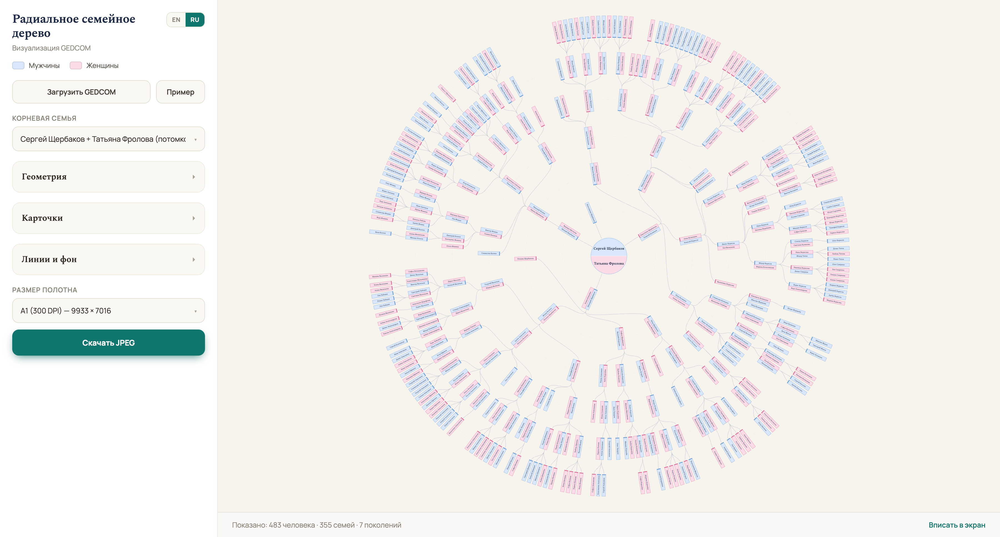

# Radial Family Tree (GEDCOM)

GEDCOM file visualizer: the descendant tree is laid out on radial generation
rings with the root couple at the center. Built with D3.js, Vite and
TypeScript. The UI is bilingual (English/Russian) with a language switcher.



*JPEG export of the bundled sample dataset (`examples/example-large.ged`,
489 people, synthetic data): the root couple sits at the center, each ring
is a generation, and every card is a person — spouses joined by a marriage
line, descendants fanning outward.*

## Running

```bash
npm install
npm run dev      # dev server with hot reload
npm run build    # typecheck + build into dist/
npm run preview  # local preview of the build
```

## Features

- GEDCOM loading (button or drag & drop), built-in sample
  (`examples/example-large.ged`).
- Root family selection from a list (progenitors first, sorted by descendant
  count).
- Adjustable geometry (ring gaps, outer-ring growth, card size and spacing)
  and styling (colors, font, lines, canvas) — everything recomputes live, zoom
  is preserved.
- Remarriages: a person married several times keeps one card, with their
  spouses fanned out beside it and each marriage's children on their own
  branch.
- Names never render upside down on the left half of the circle; card
  tooltips show life years; a marriage line connects spouse cards.
- Zoom/pan, fit-to-view.
- Print-ready JPEG export A3–A0 (300 DPI) plus screen presets (Full HD, 4K,
  square) — native SVG serialization, no third-party libraries.

## Architecture

```
src/
  gedcom/    GEDCOM parser → Map<Individual>, Map<Family>
  tree/      descendant tree from the selected root family
  layout/    pure radial layout computation (no tree/DOM mutation)
  render/    D3 renderer: keyed joins, incremental updates, zoom
  export/    SVG → canvas → JPEG for print
  ui/        settings panel generated from descriptors
  main.ts    app state and module wiring
```

The data flow is unidirectional: `GEDCOM → GedcomData → DescendantTree →
Layout → SVG`. A settings change recomputes only `Layout → SVG`; a root
change starts from `DescendantTree`.

Detailed documentation lives in [docs/](docs/README.md): architecture, layout
algorithm, GEDCOM support, settings reference, export and development.
